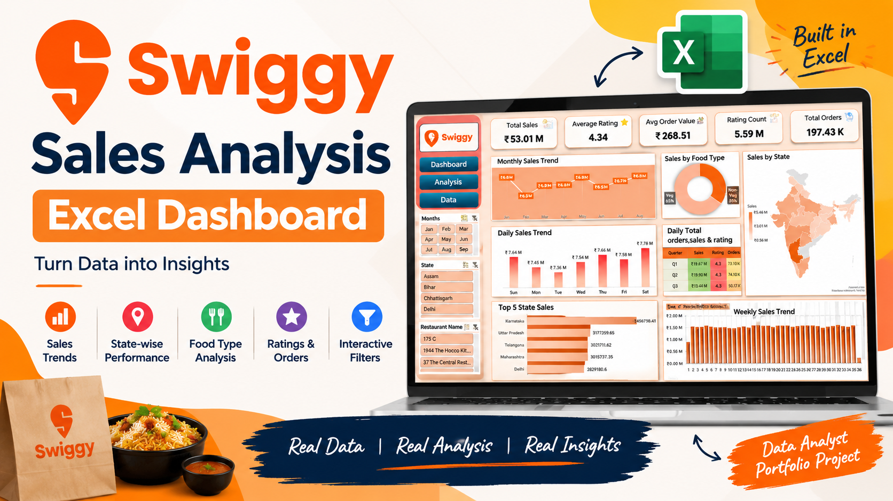

<p align="center">
  
</p>

<h1 align="center">Swiggy Sales & Order Analysis Dashboard</h1>
<p align="center"><b>An interactive Excel dashboard turning 197,430 food-delivery order records into business insights</b></p>

<p align="center">
  
  
  
  
</p>

<p align="center">
  <a href="https://1drv.ms/x/c/cbf615f6cf8b4d72/IQC3o8yVFT9aTYvkOBoxL9JiAXMfOFXEnnTPoxHrWiEOqeo?e=67fkd5"><b>Live Interactive Dashboard</b></a> ·
  <a href="https://youtu.be/qVFuM5_s5vI?si=afVB3IrdwISk9j0O"><b>Video Walkthrough</b></a> ·
  <a href="https://docs.google.com/presentation/d/10Uo5rZn7wzgOIPPcZ9xi8FY0uFTb_60cT1R9cKa0sS0/edit?usp=sharing"><b>Project Deck</b></a>
</p>

---

## Overview

This project analyzes **197,430 Swiggy food-delivery order records** spanning **28 states**, **993 restaurants**, and **8 months (Jan–Aug 2025)** to uncover sales trends, geographic performance, food-type preferences, and customer satisfaction patterns.

The end result is a fully interactive **Excel dashboard** — built with pivot tables, pivot charts, and slicers — that lets anyone filter the entire dataset by month, state, or restaurant and instantly see how the headline numbers move.

The workflow behind it:

```
Raw Order Data  →  Data Cleaning & Preparation  →  Pivot Analysis  →  Interactive Dashboard  →  Business Insights
```

## Business Questions Answered

| Theme | Questions |
|---|---|
| **Financial performance** | Total sales generated · Total orders placed · Average order value |
| **Trends over time** | How sales move month-to-month, week-to-week, and day-to-day · Quarterly performance |
| **Geography & category** | Which states drive the most revenue · Which restaurants/categories contribute most |
| **Customer behavior** | Veg vs. Non-Veg order split · Distribution and consistency of customer ratings |

## Key Metrics (KPIs)

| Metric | Value |
|---|---|
| 💰 Total Sales | **₹53.01M** |
| 📦 Total Orders | **197,430** |
| 🧾 Average Order Value | **₹268.51** |
| ⭐ Average Rating | **4.34 / 5.0** |
| 🗳️ Rating Count | **5.59M** |

## Dashboard Preview

<p align="center">
  
</p>

*(Static preview — the actual file is a fully interactive Excel workbook. [Open the live version](https://1drv.ms/x/c/cbf615f6cf8b4d72/IQC3o8yVFT9aTYvkOBoxL9JiAXMfOFXEnnTPoxHrWiEOqeo?e=67fkd5) to use the filters yourself.)*

## Key Insights

- **Karnataka leads all states** in total sales, followed by Uttar Pradesh, Telangana, Maharashtra, and Delhi — a clear signal for where market investment and restaurant onboarding pay off most.
- **Vegetarian orders make up 65%** of all orders vs. 35% Non-Vegetarian, a strong input for menu planning and restaurant-partner curation.
- **4.34/5.0 average rating across 5.59M ratings** is a statistically credible signal of consistent service quality across the platform.
- **₹268.51 average order value** points to consistent, mid-range spending behavior rather than occasional high-value outliers.
- Monthly, weekly, and daily sales views expose recurring demand patterns that can guide staffing, inventory, and promotional timing.

## Repository Structure

| Folder | Contents |
|---|---|
| [`Dashboard/`](./Dashboard) | Dashboard preview image and link to the live interactive Excel workbook |
| [`Data/`](./Data) | Raw dataset (`Swiggy Raw Data Excel.xlsx`, 197,430 rows) and its data dictionary |
| [`Documentation/`](./Documentation) | Project presentation deck (PPTX) walking through the full analysis |
| [`Demo/`](./Demo) | Video walkthrough of the interactive dashboard |
| [`Screenshots/`](./Screenshots) | Dashboard and raw-data preview images |
| [`Assets/`](./Assets) | Portfolio thumbnail / social-preview graphic |

## Dataset at a Glance

| Attribute | Detail |
|---|---|
| Rows | 197,430 order/dish-level records |
| Columns | 10 (see [`Data/README.md`](./Data) for the full data dictionary) |
| Time period | 1 Jan 2025 – 31 Aug 2025 |
| Geography | 28 states, 977 localities, 993 restaurants |
| Price range | ₹0.95 – ₹8,000 per line item |
| Rating range | 1.5 – 5.0 |

## Tools & Techniques

- **Microsoft Excel** — primary analysis and dashboarding tool
- **Pivot Tables & Pivot Charts** for multi-dimensional slicing (state, month, week, category, food type)
- **Excel formulas** for KPI computation and engineered fields (e.g., weekday, quarter, food type)
- **Slicers** for interactive filtering by Month, State, and Restaurant Name
- **Map chart** for state-wise geographic visualization
- Dashboard layout and visual hierarchy design

## Skills Demonstrated

- Cleaning and structuring 197K+ raw records for analysis
- Multi-dimensional pivot analysis across geography, time, and category
- Translating raw transactional data into meaningful business KPIs
- Interactive dashboard UX design with slicers and filters
- Communicating findings through a structured presentation deck

## How to Explore This Project

1. **Watch the [video walkthrough](https://youtu.be/qVFuM5_s5vI?si=afVB3IrdwISk9j0O)** for a guided tour of the dashboard.
2. **Open the [live Excel workbook](https://1drv.ms/x/c/cbf615f6cf8b4d72/IQC3o8yVFT9aTYvkOBoxL9JiAXMfOFXEnnTPoxHrWiEOqeo?e=67fkd5)** to interact with the filters yourself.
3. **Read the [project deck](https://docs.google.com/presentation/d/10Uo5rZn7wzgOIPPcZ9xi8FY0uFTb_60cT1R9cKa0sS0/edit?usp=sharing)** for the full narrative behind the analysis.
4. **Browse [`Data/`](./Data)** if you want to inspect or reuse the underlying dataset.

## Author

**Siddu Varikuppala**
B.Sc. (Honours) Mathematics, Statistics & Data Science student · Aspiring Data Analyst

- GitHub: [@sidducv0528](https://github.com/sidducv0528)
- LinkedIn: [siddu-data](https://linkedin.com/in/siddu-data)
- Kaggle: [sidduv0528](https://kaggle.com/sidduv0528)
