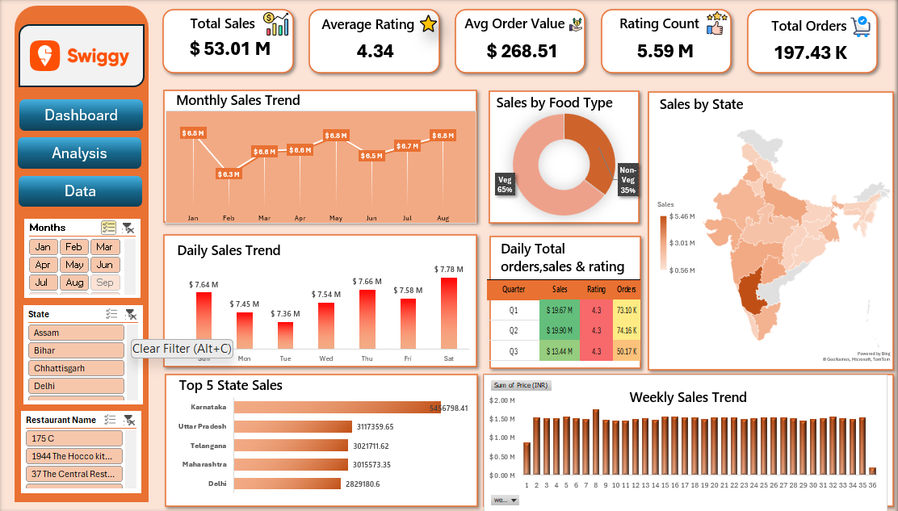
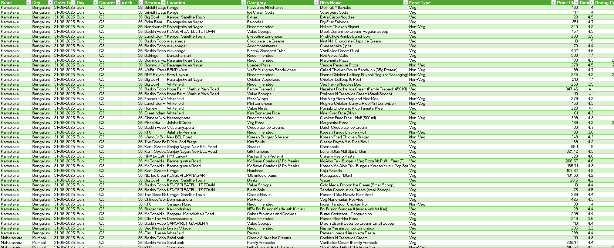

# Screenshots

Static images of the dashboard and underlying data, for quick viewing without opening Excel.

## Files

| File | Shows |
|---|---|
| `Swiggy_Dashboard.png` | Full dashboard view — KPI cards, sales trends, food-type split, state map, and top-5-state ranking |
| `Swiggy_Data_Demo.png` | A sample of the underlying row-level data, including the engineered `Day`, `Quarter`, `Week`, and `Food Type` fields used to power the dashboard's slicers and charts |

## Previews

**Dashboard**

  

**Data sample**

  

For the source files behind these images, see [`Dashboard/`](../Dashboard) and [`Data/`](../Data).
